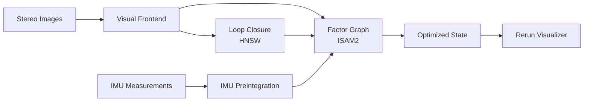

# Tightly-Coupled Visual-Inertial Odometry (VIO)

A real-time stereo visual-inertial odometry system using factor graph optimization (GTSAM ISAM2) with explicit landmark management, loop closure detection, and live 3D visualization.

  

---

## Results

<p align="center">
  
  <br/>
  <sub>Azure colored dots — Re-visited landmarks from previous frames (valid loop closure candidates)</sub>
</p>

---

## System Architecture



---

## Pipeline Components

### 1. Visual Frontend (`v_frontend.py`)

Processes stereo image pairs to produce landmark observations and 3D triangulations.

| Stage | Method | Purpose |
|-------|--------|---------|
| Feature Extraction | XFeat (1024 pts) | Repeatable keypoints with dense descriptors |
| Stereo Matching | Cosine Similarity + Epipolar Filter | Left-right correspondence with geometric validation |
| Temporal Tracking | KLT Optical Flow | Frame-to-frame feature association with forward-backward check |
| Triangulation | Linear SVD (rectified) | Depth from stereo disparity, filtered by reprojection error |
| Track Management & Propagation | Feature Spatial Distribution filter | Persistent landmark identity across frames |

- **IMU-Guided Tracking**: When the optimizer converges (avg error < 2.0), IMU-predicted rotation initializes optical flow for improved tracking under fast motion.

- **Spatial distribution ensurance**:  Choose only observations/keypoints that are well distributed across the image, preventing clustered features from degenerating the factor graph.

---

### 2. IMU Preintegration (`imu_pipeline.py`)

Integrates high-rate (200 Hz) accelerometer and gyroscope measurements between camera keyframes using GTSAM's `PreintegratedImuMeasurements`.

- **Noise Model**: Continuous-time noise densities from EuRoC sensor datasheet
- **Bias Handling**: Bias estimates updated from GTSAM after each optimization step
- **Output**: Preintegrated IMU factor constraining consecutive pose-velocity-bias states

---

### 3. Factor Graph Backend (`vio_optimizer.py`)

Incremental nonlinear optimization via ISAM2 with the following factor types:

| Factor | Variables | Role |
|--------|-----------|------|
| `PriorFactorPose3` | X(0) | Anchors world frame origin |
| `ImuFactor` | X(i), V(i), X(i+1), V(i+1), B(i) | IMU motion constraint |
| `BetweenFactorConstantBias` | B(i), B(i+1) | Bias random walk |
| `GenericProjectionFactor` | X(i), L(j) | Pixel reprojection with body-camera extrinsic |
| `PriorFactorPoint3` | L(j) | Weak landmark regularization (σ=1.5m) |

**Landmark Buffering**: Landmarks require observations from ≥2 distinct poses before promotion to the graph. This prevents underconstrained variables and avoids degenerate single-view landmarks.

**Promotion Validation**:
- Camera-frame depth ∈ [0.2m, 20m]
- Positive depth from ALL observing cameras (Z > 0.5m)
- Maximum parallax angle ≥ 2.5° between any two observing cameras

***Parallax Verification***:

    Instead of a naive baseline distance check, landmarks are validated by computing the maximum angle between observation rays from camera centers to the 3D point.
    
    This directly measures triangulation quality (σ² ∝ d² / sin²(θ)) , naturally adapts to landmark depth, and generalizes to N>2 observations.
    
    Low-parallax landmarks produce near-zero Jacobians in the projection factor,
    
    causing indeterminate linear systems — rejecting them significantly improves ISAM2 convergence stability.
    (This greatly increased the trajectory accuracy)

**Robust Loss**: Huber norm (k=1.345) on pixel noise (σ=2px) rejects outlier measurements without removing them from the graph.

**Bias Noise Modeling**: The `BetweenFactorConstantBias` uses properly scaled discrete noise derived from continuous-time random walk densities:

```
σ_discrete = σ_continuous_rw × √(Δt)
```

where `Δt` is the preintegration interval (`preint.deltaTij()`). This yields a **diagonal** (not isotropic) noise model with per-axis sigmas:

| Axis | Continuous RW Density | Discrete σ (Δt≈0.5s) |
|------|----------------------|----------------------|
| Accelerometer | 3.0e-3 m/s³/√Hz | ~2.1e-3 |
| Gyroscope | 1.9e-5 rad/s²/√Hz | ~1.4e-5 |

This is critical — a naive isotropic σ=0.3 makes the bias factor ~21,000× too loose for gyroscope, allowing bias to absorb real motion and causing trajectory drift. (Initially using this naive value, the trajectory exhibited severe drift & inferior accuracy.) The properly scaled noise constrains bias evolution to physically plausible rates.

**Prior Noise**: Tight rotation prior (σ=0.03 rad ≈ 1,7°) and bias prior (σ=1e-3) anchor the initial state, preventing early heading divergence.


---

### 4. Loop Closure Detection (`v_frontend.py` — HNSW)

Descriptor-based place recognition using an approximate nearest-neighbor index.

```
Current Frame Descriptors
        │
        ▼
   HNSW Index (hnswlib, L2)
        │
        ▼
  Top-K Similar Landmarks
        │
        ▼
  Frame Voting (by landmark_last_frame)
        │
        ▼
  Geometric Visibility Filter (Z > 0.5m in camera frame)
        │
        ▼
  Reprojection Factors → ISAM2
```

- **Index**: Only temporally-tracked landmarks are indexed (multi-frame verified)
- **Temporal Gap**: Minimum 15-frame separation to avoid trivial self-matches
- **Update Frequency**: Every 5 frames (index + query)

---

### 5. Real-Time Visualization (`vio_visualizer.py`)

Multi-panel [Rerun](https://rerun.io/) viewer with synchronized timelines:

| Panel | Content |
|-------|---------|
| 3D Map | Viridis-colored point cloud + red trajectory + pose axes |
| Left/Right Camera | Feature overlays with per-landmark coloring |
| Optimization Error | Average error per factor (time-series) |
| Observations | Landmark count, IMU samples, graph size |
| Pose Status | Translation, rotation, inter-frame delta, total travel distance |

Loop closure landmarks are highlighted in **cyan** with ID labels.

---

## State Representation

Each keyframe `i` introduces 3 variable nodes:

| Symbol | Type | Description |
|--------|------|-------------|
| `X(i)` | `Pose3` | Body pose in world frame (SE(3)) |
| `V(i)` | `Vector3` | Velocity in world frame |
| `B(i)` | `ConstantBias` | IMU accelerometer + gyroscope bias (6D) |

Landmarks `L(j)` are 3D points in world coordinates, shared across all observing poses.

---

## Dataset

Evaluated on [EuRoC MAV](https://projects.asl.ethz.ch/datasets/doku.php?id=kmavvisualinertialdatasets) — **MH_01_easy** sequence.

- Stereo camera: 20 Hz (processed every 10th frame → ~2 Hz effective)
- IMU: 200 Hz (100 samples between keyframes)
- Extrinsics: `T_imu_cam0` from sensor calibration YAML

---

## Dependencies

```
gtsam          # Factor graph optimization
torch          # SuperPoint / LightGlue inference
lightglue      # Feature matching
hnswlib        # Approximate nearest neighbor search
opencv-python  # Image processing, stereo rectification
rerun-sdk      # Real-time 3D visualization
numpy, scipy, pandas
```

---
## Trajectory Accuracy (ATE)

Absolute Trajectory Error after SE(3) Umeyama alignment on **MH_01_easy** (328 frames):

> **Note:** The graph is initialized with identity SE(3) pose and zero velocity/bias — high max error reflects early convergence stages.

| Metric | Value |
|--------|-------|
| **RMSE** | 0.5779 m |
| Mean | 0.3455 m |
| Median | 0.2843 m |
| Max | 6.6450 m |
| Std | 0.4633 m |
------------------------------------------------------------
 #### Relative Trajectory Error (RTE)
 
| Metric | Value |
|--------|-------|
| **RMSE** | 0.4775 m |
| Mean | 0.1289 m |
| Median | 0.0633 m |
| Max | 6.1195 m |
| Std | 0.4598 m |


The Rerun viewer launches automatically. Processing logs are printed to the terminal with per-frame diagnostics including graph size, optimization error, and tracking statistics.

---

## Key Design Decisions

1. **Explicit landmarks over marginalization** — Retaining L(j) in the graph enables natural loop closure via re-observation, at the cost of graph size.

2. **Stereo triangulation in camera frame** — Points are triangulated from rectified stereo, then transformed to world frame using the current pose estimate. This decouples triangulation accuracy from odometry drift.

3. **Adaptive IMU-guided flow** — IMU rotation is only used for optical flow initialization once the optimizer has converged (error < 2.0/factor). This prevents poorly-calibrated biases from degrading tracking.

4. **Incremental ISAM2 over batch** — Enables real-time operation with O(log n) updates per frame. Relinearization threshold of 0.01 ensures accuracy without excessive computation.
