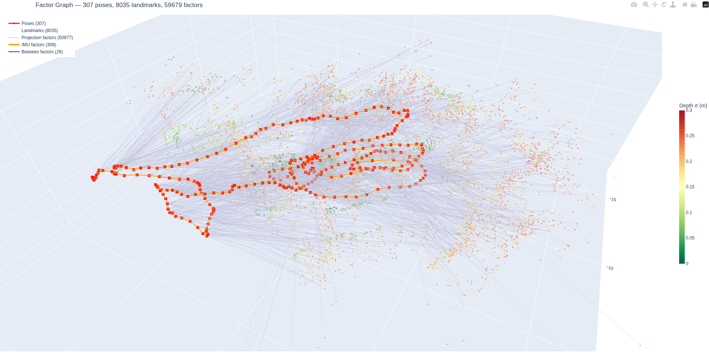
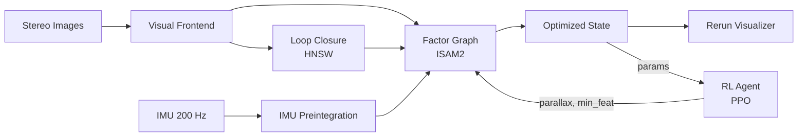

# VIO-Tightly — Tightly-Coupled Visual-Inertial SLAM

A thorough implementation of stereo visual-inertial odometry + mapping system, working in a Direct-Method (No feature-matching, minimization of photometric error with KLT) using factor graph optimization (GTSAM/ISAM2) with explicit landmark management, keyframe-based graph growth, loop closure detection, Inverse depth-certainty gating and live 3D visualization.

  

---

## Result Showcase

<p align="center">
  
  <br/>
  <sub>Cyan colored dots — Re-visited landmarks from previous frames (valid loop closure candidates) <br>Green Trajectory - GT</br></sub>
</p>

<p align="center">
  
  <br/>
  <sub>Factor graph visualization — 307 poses, 8035 landmarks observed, ~60k factors. Landmarks colored by depth uncertainty (relative) (green = low σ, red = high σ).</sub>
</p>

---

## System Architecture


```mermaid
graph LR
    A[Stereo Images] --> B[Visual Frontend]
    C[IMU 200 Hz] --> D[IMU Preintegration]
    B --> E[Factor Graph<br/>ISAM2]
    D --> E
    B --> F[Loop Closure<br/>HNSW]
    F --> E
    E --> G[Optimized State]
    G --> H[Rerun Visualizer]
    G -->|params| RL[RL Agent<br/>PPO]
    RL -->|parallax, min_feat| E
```

---

## Pipeline Components

### 1. Visual Frontend (`v_frontend.py`)

Processes stereo image pairs to produce landmark observations, 3D triangulations, and keyframe decisions via median pixel displacement.

| Stage | Method | Purpose |
|-------|--------|---------|
| Feature Extraction | XFeat (1024 pts) | Repeatable keypoints with dense descriptors |
| Stereo Matching | Cosine Similarity + Epipolar Filter | Left-right correspondence with geometric validation |
| Temporal Tracking | KLT Optical Flow (forward-backward) | Frame-to-frame association; static features filtered by displacement threshold |
| Triangulation | Linear SVD (rectified) | Depth from stereo disparity, filtered by reprojection error |
| Keyframe Decision | Depth uncertainty from Parallax | Only frames with sufficient parallax are committed to the graph |
| Loop Closure | HNSW descriptor index + frame voting | Re-observed landmarks from ≥15 frames ago, geometric visibility filter |

- **IMU-Guided Tracking**: When the optimizer converges (`avg_error < 2.0`), IMU-predicted rotation initializes optical flow for improved tracking under fast motion.
- **Spatial Distribution**: Grid-based bucketing ensures well-distributed features across the image.

### 2. IMU Preintegration (`imu_pipeline.py`)

Integrates high-rate (200 Hz) accelerometer and gyroscope measurements between keyframes using GTSAM's `PreintegratedImuMeasurements`.

| Aspect | Detail |
|--------|--------|
| Noise Model | Continuous-time densities from EuRoC datasheet (5× safety factor) |
| Bias Handling | Updated from GTSAM after each optimization; random walk properly scaled by √Δt |
| Accumulation | Not reset on skipped frames — one `ImuFactor` spans the full keyframe interval |

### 3. Factor Graph Backend (`vio_optimizer.py`)

Incremental nonlinear optimization via ISAM2 with explicit 3D landmarks.

| Factor | Variables | Role |
|--------|-----------|------|
| `PriorFactorPose3` | X(0) | Anchors world frame origin |
| `ImuFactor` | X(i), V(i), X(i+1), V(i+1), B(i) | IMU motion constraint |
| `BetweenFactorConstantBias` | B(i), B(i+1) | Bias random walk (σ scaled by √Δt) |
| `GenericProjectionFactorCal3_S2` | X(i), L(j) | Pixel reprojection (Huber k=1.345, σ=1.0 px) with body-camera extrinsic |
| `PriorFactorPoint3` | L(j) | Landmark regularization (σ=1.5 m) |

**Landmark lifecycle**: buffer (first sighting) → promote (3+ poses, parallax ≥ 2,5°, depth ∈ [0.2, 15] m, cheirality OK) → track (incremental-parallax gate ≥ 2°, grid bucketing 13×13 px).

### 4. Keyframe Gating (`main_threaded.py`)

| Mechanism | Condition |
|-----------|-----------|
| Initialization period | Every frame is a keyframe until covariance-trace relative std < 0.002 over 5 KF |
| Keyframe decision | Accumulated median displacement ≥ 20 px since last keyframe |
| Non-keyframe handling | Visual observations dropped; IMU accumulates across skipped frames |

### 5. Real-Time Visualization (`vio_visualizer.py`)

Multi-panel [Rerun](https://rerun.io/) viewer with synchronized timelines.

| Panel | Content |
|-------|---------|
| 3D Map | Viridis-colored point cloud + red trajectory + pose axes |
| Left/Right Camera | Feature overlays with per-landmark coloring |
| Optimization Error | Average error per factor (time-series) |
| Observations | Landmark count, IMU samples, graph size |
| Pose Status | Translation, rotation, inter-frame delta, total travel distance |

---


## System Overview

| Layer | Responsibility |
|-------|----------------|
| **Frontend thread** (`v_frontend.py`) | XFeat feature extraction, stereo matching + triangulation, KLT temporal tracking, median-displacement computation, loop-closure candidate retrieval (HNSW). Runs one frame ahead of the backend. |
| **Backend thread / main** (`main_threaded.py`) | IMU preintegration, keyframe gating, factor-graph growth, ISAM2 optimization, covariance/degeneracy analysis, ATE/RTE, visualization. |
| **Optimizer** (`vio_optimizer.py`) | GTSAM wrapper: landmark lifecycle (buffer → promote → track), IMU/visual/loop factors, noise models, covariance queries. |

**Factor type:** `GenericProjectionFactorCal3_S2` (explicit 3D landmarks `L(id)`, poses
`X(i)`, velocities `V(i)`, biases `B(i)`).
**Estimator:** ISAM2, incremental, `relinearizeThreshold = 0.03`, `relinearizeSkip = 2`.
**Threading:** frontend pushes to a `Queue(maxsize=2)`; the backend pulls. A lock-free
holder feeds the IMU-derived rotation back to the frontend with one-frame latency.

---

## 2. Core Theory

### 2.1 Parallax governs triangulation quality
Depth uncertainty of a triangulated point scales as

$$\sigma_d^2 \;\propto\; \frac{d^2}{\sin^2\theta},$$

where $d$ is depth and $\theta$ is the **parallax angle** (the angle between the two rays
from the observing camera centers to the landmark). Small $\theta$ ⇒ near-parallel rays ⇒
huge depth uncertainty and near-zero Jacobians, which destabilize ISAM2 (indeterminate
linear systems, poor convergence). Parallax is therefore the *primary geometric quality
gate* throughout the pipeline. For small angles $\theta \approx \text{baseline}/d$ (1° at
5 m ≈ 8.7 cm of baseline).

### 2.2 Pixel-noise weighting
Each visual factor's information is $\propto 1/\sigma_\text{px}^2$. A **tighter** sigma
makes every factor more influential — but that only helps if the factors are
geometrically well-conditioned. Tightening sigma without filtering weak (low-parallax)
observations amplifies their harm. Hence the pixel-noise reduction (§4.1) is paired with
an incremental-parallax observation gate (§3.3).

### 2.3 Keyframing
Consecutive high-rate frames carry redundant visual information yet each adds
poses/factors and accumulates linearization error. A **keyframe** is committed only when
the camera has moved enough to add real parallax; intermediate frames are skipped from
the graph but their IMU is still integrated (no inertial information is lost).

---

## 3. Landmark Lifecycle (`vio_optimizer.py`)

```
First sighting ─► BUFFER ─► (3+ distinct poses & parallax ≥ 2.5°) ─► PROMOTE ─► TRACK
                  (needs 3D)    depth/cheirality checks               incremental-parallax gated
```

### 3.1 Grid-based observation bucketing (spatial distribution)
- **`obs_cell_size = 13`** px — the image is divided into 13×13 cells.
- **`_frame_occupied_cells`** — set of occupied cells per `state_idx`.
- **`_is_cell_available(state_idx, uv)`** — at most **one factor per cell per pose**,
  preventing clustered features from dominating the graph.
- Applied in all three cases of `add_landmark_observation` (initialized / buffered / new).

### 3.2 Promotion gate (buffer → graph)
A buffered landmark is promoted only when **all** of these hold:
- **3+ distinct observing poses** (re-checked at 3, then every even count, to avoid
  repeated expensive parallax computation).
- **Depth in `[0.2 m, 15.0 m]`** (camera-frame `Z`), else permanently rejected.
- **Max parallax angle ≥ 5°** (`_max_parallax_deg`), else kept in buffer to retry later.
- **Positive depth from every observing camera** (cheirality, `Z > 0.2 m`).

On promotion: insert `L(id)`, add an isotropic **regularization prior (σ = 1.5 m)** to
prevent indeterminate systems, and flush all buffered projection factors.

### 3.3 Incremental-parallax observation gate (tracking)  *(NEW)*
For a landmark **already in the graph**, a new projection factor is added only if the
current camera has moved enough since the **last view that contributed a factor** for that
landmark:
- **`min_obs_parallax_deg = 2°`** — re-observations below this incremental parallax are
  skipped (they add little depth information but, at tight pixel sigma, still pull the
  pose).
- Bookkeeping: `landmark_last_factor_cam[id]` stores the reference camera center; seeded at
  promotion and advanced each time a factor is accepted.
- Helpers: `_camera_position(state_idx)`, `_obs_parallax_deg(landmark_id, state_idx)`
  (returns `None` ⇒ no reference yet ⇒ not gated).

This complements the tighter pixel sigma (§4.1): the looser old sigma implicitly discounted
weak factors; the tighter sigma needs them filtered explicitly.

---

## 4. Noise Models & Weighting (`vio_optimizer.py`)

### 4.1 Visual reprojection noise  *(UPDATED)*
- **Huber robust, k = 1.345, σ = 1.0 px** (was 1.5 px). Lowering sigma measurably improved
  accuracy; see §2.2.


### 4.3 Priors
| Prior | Value | Purpose |
|-------|-------|---------|
| Pose `X(0)` | σ = [0.03 rad ×3, 0.10 m ×3] | Anchor first pose (tight rotation, moderate translation). |
| Velocity `V(0)` | σ = 0.10 m/s | Anchor initial velocity. |
| Bias `B(0)` | σ = [0.01 m/s² ×3, 0.003 rad/s ×3] | Trust static calibration, allow online refinement. |
| Landmark regularization | isotropic σ = 1 m | Prevent indeterminate systems during relinearization. |
| Bias random walk | `imu_calib.bias_between_sigmas(dt)` | `BetweenFactorConstantBias`, scaled by interval. |

### 4.4 Cheirality handling
Projection factors use **`throwCheirality = False`** → a landmark projecting behind the
camera yields zero error/Jacobian instead of throwing, giving graceful degradation.

---

## 5. Keyframe Gating & Initialization  *(NEW — `main_threaded.py`)*

The backend no longer commits every frame. Graph state indices use a **contiguous keyframe
counter `kf_idx`** (not the raw frame index), keeping the graph and visualizer dense.

### 5.1 Initialization period (covariance-based)
Until the graph is trustworthy, **every frame is a keyframe** so constraints accumulate.
After each optimize, the **position-covariance trace** is pushed to a rolling window:
- **`INIT_STABLE_WINDOW = 5`** keyframes.
- When the window's **relative std** (`std/mean`) falls below
  **`INIT_STABLE_REL_STD = 0.002`**, initialization completes and keyframe gating switches on.

### 5.2 Keyframe decision (post-init)
Per-frame median pixel displacement (parallax proxy from the frontend) is accumulated since
the last keyframe. A frame becomes a keyframe when

> `accumulated_disp ≥ KF_DISP_THRESHOLD` (**20.0 px**, tunable).

Non-keyframes drop their visual observations but **keep accumulating IMU** (§5.3).

### 5.3 IMU accumulation across skipped frames
Preintegration is **not** reset on skipped frames — it accumulates so a single `ImuFactor`
spans the whole keyframe-to-keyframe interval. The accumulator (and the IMU-flow rotation
feedback) reset **only after a keyframe commits**. Bias for the next interval is read from
`B(kf_idx)` after optimize.

### 5.4 Adaptive IMU-guided optical flow
`use_imu_for_flow` toggles on `avg_error_per_factor < imu_flow_error_threshold` (**2.0**);
the IMU-derived inter-keyframe rotation is handed to the frontend (one-frame latency) only
while the optimizer is converged.

---

## 6. Logging / Info gathering  *(NEW)*

- **`parallax_log`** + **`drain_parallax_stats()`** — records the max-parallax angle of every
  promotion attempt (including rejected ones) and drains
  `{parallax_max_deg, parallax_median_deg, parallax_count}` per optimize cycle.
- **`gating_analysis_log.csv`** (written by the backend) — per-keyframe geometry vs.
  conditioning: accumulated displacement, parallax stats, covariance trace + eigenvalues,
  condition number, degeneracy/motion type, avg/total error, factor count.
- **`analyze_gating.py`** — loads the CSV, computes Pearson/Spearman correlations between
  geometric drivers (parallax, displacement) and graph conditioning (cov trace, condition
  number, avg error), and saves scatter/timeseries plots.

**Empirical findings:** parallax ↔ covariance-trace correlation ≈ −0.35…−0.49 (confirms the
triangulation physics of §2.1), saturating with a knee around ~5–10° max parallax /
~20–30 px median displacement — which motivates the 5° promotion gate and the 20 px
keyframe threshold.

---

## 7. Optimization Loop (ISAM2)

- `isam.update(graph, initial)`, then clear pending graph/values.
- If `> 8` variables were relinearized, run **one extra `isam.update()`** for convergence.
- **Indeterminate-system recovery:** catch the exception, discard the offending batch, and
  continue (instead of crashing).
- Covariance via `marginalCovariance(X(kf_idx))`; degeneracy via eigen-analysis of the 3×3
  position block (`condition_number`, `motion_type`, `degenerate`).

---

## 8. Run Configuration (`main_threaded.py`)

| Parameter | Value |
|-----------|-------|
| `frame_step` | 10 |
| `start_frame` | 400 (`40 × frame_step`) |
| `loop_closure_start_frame` | 10 (keyframes) |
| `use_imu_for_flow` (initial) | `False` |
| `imu_flow_error_threshold` | 2.0 |
| Matcher | XFeat (`matcher_type="xfeat"`, CPU) |
| Dataset | EuRoC `MH_01_easy` |

---

## 9. Algorithm Flow


```mermaid
flowchart TD
    subgraph Frontend["Frontend Thread (1 frame ahead)"]
        A[Read Stereo Images] --> B[XFeat Extraction]
        B --> C[Stereo Match + Triangulate]
        C --> D[KLT Temporal Tracking]
        D --> E{IMU Rotation Available?}
        E -->|Yes| F[IMU-Guided KLT Guess]
        E -->|No| G[Standard KLT]
        F --> H[Forward-Backward Check]
        G --> H
        H --> RANSAC{2pt/5pt RANSAC}
        RANSAC --> MD[Median Displacement]
        RANSAC --> I[HNSW Loop Candidates]
        MD --> J[Push to Queue]
        I --> J
    end

    subgraph Backend["Backend Thread (Main)"]
        K[Pull from Queue] --> L[IMU Preintegration ACCUMULATE]
        L --> INIT{init_done?}
        INIT -->|No| KF[Force Keyframe]
        INIT -->|Yes| GATE{accumulated_disp >= threshold?}
        GATE -->|No| SKIP[Drop visual, keep IMU]
        GATE -->|Yes| KF
        KF --> STATIC{Stationary?}
        STATIC -->|Yes| ZM[Zero-Velocity + Zero-Motion Prior]
        STATIC -->|No| RL_STEP
        ZM --> RL_STEP[RL Agent: Select Params]
        RL_STEP --> M[Predict NavState]
        M --> N[Add State + IMU Factor at kf_idx]
        N --> O[Process Visual Observations]
    end

    subgraph Landmarks["Landmark Handling"]
        O --> P{Status?}
        P -->|Initialized| Q[Cell + Incremental-Parallax 2deg Gate]
        P -->|Buffered| R[Cell Check -> Append]
        P -->|New| S[Cell Check -> Buffer]
        Q -->|Pass| T[Add Projection Factor]
        R --> V{3+ Distinct Poses?}
        V -->|Yes| W[Promote]
    end

    subgraph Promotion["Promotion Gate (Depth Filter)"]
        W --> DF[Uncertainty Depth Filter Update]
        DF --> DFC{Converged? rel_σ < 0.1 & a ≥ 0.5}
        DFC -->|No, a < 0.3| REJECT[Reject Outlier]
        DFC -->|No, pending| KEEP[Keep in Buffer]
        DFC -->|Yes| PA[Depth 0.2-15m]
        PA --> PB[Parallax ≥ threshold]
        PB --> PC[Cheirality All Cameras]
        PC --> PE[Insert L + Prior + Factors]
    end

    subgraph Optimize["ISAM2"]
        PE --> OPT[isam.update]
        T --> OPT
        OPT --> OPT2{Relinearized > 50?}
        OPT2 -->|Yes| OPT3[Extra update]
        OPT2 -->|No| OPT4[Done]
        OPT3 --> OPT4
        OPT4 --> COV[Covariance + Degeneracy]
        COV --> INITCHK[Init Window: rel_std stable over 5 KF]
        INITCHK --> LOG[gating_analysis_log.csv]
        LOG --> ATE[ATE / RTE]
        ATE --> VIS[Visualization]
    end

    subgraph Shared["Shared State (Lock-Protected)"]
        OPT4 -->|R_prev_curr per keyframe| IMU_ROT[IMU Rotation Holder]
        IMU_ROT -.->|one-frame latency| E
    end

    J -->|Queue maxsize=2| K
```

---

## 10. Key Design Decisions

| Aspect | Choice | Rationale |
|--------|--------|-----------|
| Factor type | `GenericProjectionFactorCal3_S2` | Explicit landmarks, incremental obs, loop closure |
| Visual noise | Huber k=1.345, **σ = 0.5 px** | Tighter sigma improved accuracy (paired with parallax + depth gating) |
| Loop-closure noise | Separate Huber model (σ = 0.2 px) | Tunable loop weighting without touching tracking |
| Promotion gate | 3+ poses + parallax **≥ 2.5°** | Well-conditioned triangulation |
| Observation gate | incremental parallax **≥ 2°** | Drop weak re-observations under tight sigma |
| Grid bucketing | **13×13 px**, 1 obs/cell/frame | Spatial diversity, avoid clustered factors |
| Landmark prior | isotropic σ = 1 m | Prevent indeterminate systems |
| Depth range | **[0.2 m, 15.0 m]** | Reject degenerate triangulations |
| Keyframe gate | accumulated displacement ≥ **20 px** | Commit only informative frames |
| Init period | cov-trace rel_std < **0.002** over **5** KF | Stabilize before gating |
| IMU handling | accumulate across non-keyframes | One IMU factor per keyframe interval |
| Cheirality | `throwCheirality=False` | Graceful degradation |
| ISAM2 | relinearizeThreshold=0.03, skip=2 | Aggressive relinearization |
| Threading | frontend 1 frame ahead, Queue(2) | Pipelined with backpressure |
| IMU flow | adaptive on `avg_error < 2.0` | Use only when converged |

---

## 11. Reference Results (baseline)


```
FINAL ATE (Absolute Trajectory Error)
  RMSE:    0.1428 m
  Mean:    0.1257 m
  Median:  0.1162 m
  Max:     0.3997 m
  Std:     0.0677 m
  Frames:  328

FINAL RTE (Relative Trajectory Error)
  RMSE:    0.1866 m
  Mean:    0.1600 m
  Median:  0.1523 m
  Max:     0.7390 m
  Std:     0.0960 m
  Segments: 324
```

---

## 12. Change Log

1. **Pixel noise 1.5 → 0.5 px** — improved accuracy, we can relax noise due to the new depth-uncertainty filter.
2. **Promotion parallax 2.5°**, depth range `[0.25, 20] → [0.2, 15] m`, grid cell
   `16 → 13 px` — stricter landmark quality.
3. **Loop-closure noise model** — separate, tunable `loop_pixel_noise`.
4. **Incremental-parallax observation gate** (`min_obs_parallax_deg = 2°`) — filters weak
   re-observations now that pixel sigma is tight.
5. **Keyframe gating** (displacement ≥ 20 px) + **covariance-based init period**
   (rel_std < 0.002 over 5 KF) + **IMU accumulation** across skipped frames.
6. **Instrumentation** — `parallax_log` / `drain_parallax_stats`, `gating_analysis_log.csv`,
   `analyze_gating.py`.
7. **Probabilistic depth filter (_Inspired by SVO-PRO paper_)** — Gaussian-Uniform mixture in inverse depth gates landmark
   promotion. Models each landmark's inverse depth as a two-component mixture:

   $$p(\rho) \;=\; a \cdot \mathcal{N}(\rho;\, \mu,\, \sigma^2) \;+\; (1 - a) \cdot \mathcal{U}(\rho_{\min},\, \rho_{\max})$$

   where $\rho = 1/d$ is inverse depth, $a \in [0, 1]$ is the **inlier probability**, the
   Gaussian component captures the true depth, and the uniform component absorbs outlier
   measurements over the range $[\frac{1}{d_{\max}},\, \frac{1}{d_{\min}}]$.

   **Bayesian update** — each new depth measurement $z = 1/d_{\text{obs}}$ updates the
   filter via:

   $$S = \sigma^2 + \tau^2, \qquad p_G = \mathcal{N}(z;\, \mu,\, S), \qquad p_U = \frac{1}{\rho_{\max} - \rho_{\min}}$$

   $$a' = \frac{a \cdot p_G}{a \cdot p_G + (1 - a) \cdot p_U}$$

   $$K = \frac{\sigma^2}{S}, \qquad \mu' = \mu + K(z - \mu), \qquad \sigma'^2 = (1 - K)\,\sigma^2$$

   where $\tau$ is the inverse-depth measurement noise std. The inlier probability $a$
   rises when measurements are consistent with the Gaussian mode and falls when they look
   uniformly distributed (outlier). The Gaussian mean and variance follow a standard
   Kalman update.

   **Convergence criteria** — a landmark is promoted only when all three hold:
   - Relative uncertainty: $\sqrt{\sigma^2} / |\mu| < 0.1$
   - Absolute depth sigma: $\sigma_d = \sqrt{\sigma^2} \cdot d^2 < 0.25\,\text{m}$
   - Inlier probability: $a \geq 0.5$

   Landmarks with $a < 0.3$ after 3+ measurements are permanently rejected as outliers.

8. **2pt/5pt RANSAC geometric outlier rejection** — after KLT forward-backward consistency,
   epipolar RANSAC removes geometrically inconsistent tracks. 2-point (translation-only,
   Sampson distance) when IMU rotation is available; 5-point (full essential matrix) fallback.
9. **RL agent integration** — PPO agent selects parallax threshold, min tracked features,
   and min observation parallax at each keyframe based on live optimizer diagnostics,
   covariance eigenvalues, and sliding-window ATE.
10. **Zero-motion constraints** — stationary detection (accumulated displacement < 1 px)
    adds zero-velocity priors (σ = 0.01 m/s) and identity `BetweenFactorPose3` constraints
    to prevent drift during static periods.
11. **Thread-safe IMU rotation sharing** — `r_prev_curr_holder` protected by `Lock` to
    guarantee the frontend reads a complete, consistent rotation matrix.
12. **IMU preintegration dt fix** — `integrate()` now tracks `end_time` across calls,
    computing dt from the last integrated sample rather than the previous sample in the
    current batch. Fixes incorrect dt when batches span non-contiguous time intervals.
13. **Factor graph 3D visualization** — `visualize_factor_graph_3d()` renders poses,
    landmarks (colored by depth uncertainty), projection/IMU/between factor edges as an
    interactive Plotly HTML file. Depth filter visualization tool
    (`visualize_depth_filter.py`) with Open3D ellipsoids or matplotlib fallback.
14. **Expanded gating log** — `gating_analysis_log.csv` now includes landmark/buffer counts,
    depth filter stats (attempted/promoted/outlier/pending), ATE RMSE + per-frame error,
    worst covariance eigenvector.
