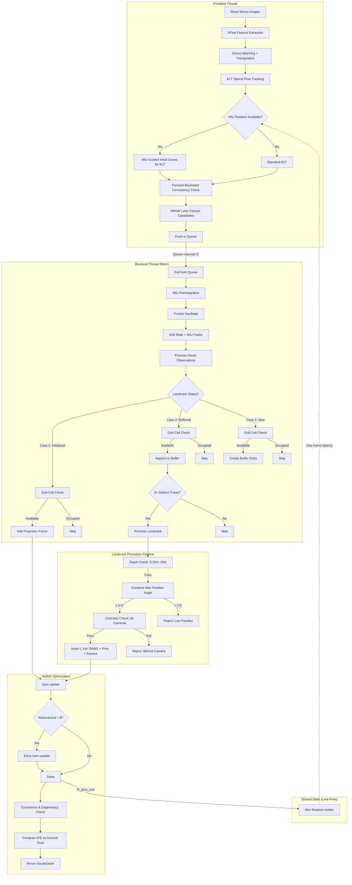

# Latest Updates — Session Summary

## Changes Made

### 1. Grid-Based Observation Bucketing (Spatial Distribution Filter)
**File:** `vio_optimizer.py`

Added a grid bucketing mechanism to ensure observations are spatially distributed across the image, preventing clustered features from dominating the factor graph.

- **`obs_cell_size = 16`** — divides the image into 16×16 pixel cells
- **`_frame_occupied_cells`** — tracks which cells are occupied per frame (state_idx)
- **`_is_cell_available(state_idx, uv)`** — returns False if cell already taken, marks it occupied otherwise
- Applied in all 3 cases of `add_landmark_observation`:
  - Case 1 (initialized landmark): skips if cell occupied
  - Case 2 (buffered landmark): skips before appending observation
  - Case 3 (new landmark): skips before creating buffer entry

### 2. Parallax Angle Validation for Landmark Promotion
**File:** `vio_optimizer.py`

Replaced the old baseline check (`max_baseline < 0.05m`) with a geometrically principled **maximum parallax angle** check.

- **`_max_parallax_deg(pt3_world, observations)`** — computes max angle between observation rays from any two camera centers to the landmark
- **Threshold: 2.5°** — landmarks with less parallax are rejected (corresponds to ~4.4% baseline/depth ratio)
- Rationale: parallax is directly proportional to triangulation quality ($\sigma_d^2 \propto d^2 / \sin^2(\theta)$), subsumes baseline check, and works naturally for N>2 observations

### 3. Tuning Adjustments
- `relinearizeThreshold`: 0.05 → 0.03 (more aggressive relinearization)
- Depth range for promotion: `[0.25m, 20.0m]`
- Front-of-camera check threshold: 0.25m

### 4. Dependency Installation
- Installed `tqdm` via `uv pip install tqdm`

### 5. Data Loading Fix (discussed, not applied)
- `data_manager.py` `iter_stereo_frames`: strip whitespace from CSV filenames (`.strip()`) and add `os.path.exists()` check before `cv2.imread()` to fix EuRoC path mismatches

---

## Current Algorithm Flow

## Key Design Decisions

| Aspect | Choice | Rationale |
|--------|--------|-----------|
| Factor type | `GenericProjectionFactorCal3_S2` | Explicit landmarks, incremental obs, loop closure |
| Noise model | Huber robust (k=1.345, σ=1.5px) | Outlier resilience without rejecting inliers |
| Promotion gate | 3+ distinct poses + parallax ≥ 2.5° | Ensures well-conditioned triangulation |
| Grid bucketing | 16×16px cells, 1 obs/cell/frame | Spatial diversity, prevents clustered factors |
| Landmark prior | Isotropic σ=1.5m regularization | Prevents indeterminate systems during relinearization |
| Cheirality | `throwCheirality=False` | Zero-error for behind-camera → graceful degradation |
| ISAM2 params | relinearizeThreshold=0.03, skip=1 | Aggressive relinearization for accuracy |
| Threading | Frontend 1 frame ahead, Queue(2) | Pipelined processing with backpressure |
| IMU flow | Adaptive enable/disable based on avg error | Only use when optimizer is converged |
